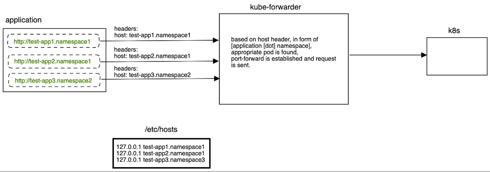

## how to build
if you want to build it from source, you need rust (super simple install)
```
https://www.rust-lang.org/tools/install
```
then just
```
sudo ./target/debug/kube-forwarder --kube-config /Users/kubeconfig.yaml
```
to forward traffic to appropriate POD. Sudo is required because of http is running on port 80.
When forwarder is running, you can curl using kube-dns entries (curl -X GET http://your-app.namespace)

To make kube-forwarder working, you need to add necessary entries in /etc/hosts. To handle following request:
```
curl http://test-app1.namespace1/some/resource
```
add 
```
127.0.0.1 test-app1.namespace1
```
in /etc/hosts

## Retry with bodies
I copied ReplyBody from https://linkerd.io/2021/10/26/how-linkerd-retries-http-requests-with-bodies/ and used it in kube-forwarded, so, proxied requests should be even more reliable.

## how it works
basically that is how it works

